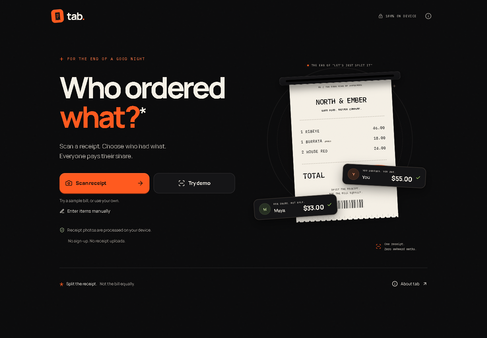
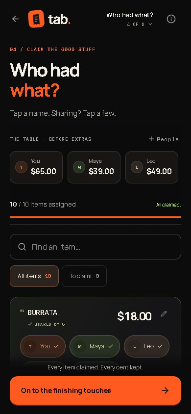
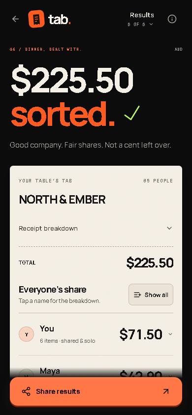
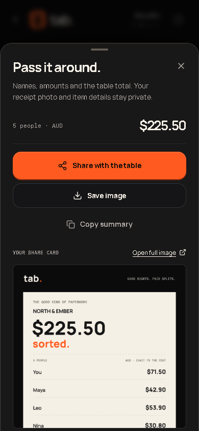

<div align="center">

# tab.
### Who ordered what?

**Split the receipt. Not the bill equally.**

**100% client-side. Receipt images are not uploaded.**

Photograph the receipt, tap who ordered each item, and settle every cent.

[The experience](#the-experience) · [Run locally](#run-locally) · [Privacy](#privacy-by-architecture) · [Deploy](#github-pages) · [Validation](docs/QA.md)



</div>

> **Release status:** prepared for GitHub Pages with installed dependencies, a committed-ready lockfile, and a real production build. Read [the current verification record](docs/RELEASE-VERIFICATION.md) for actual automated results and remaining device/deployment checks. The original offline delivery history remains in [QA.md](docs/QA.md).

**Live demo:** no live URL has been published for this source delivery. After the included workflow succeeds, the deployment URL appears under this repository’s **Actions → github-pages** environment. Set the repository’s Website field to that URL. Do not present a placeholder as a live app.

## The experience

The bill just came. One friend had a salad. Another had steak. The fries were for the table. An equal split isn’t an honest split.

**Scan → check → people → claim → extras → sorted.** A narrow scanner reads the receipt on the device. Extracted items turn into editable thermal-paper cards. Tap names directly on each item; shared amounts and each person’s running subtotal respond immediately. Results include a share card and an optional link that opens the exact split in a read-only browser view.

| One moment | What tab does |
| --- | --- |
| The receipt arrives | Camera, photo library, desktop drop zone, or manual entry |
| The scanner isn’t certain | Marked items, editable names/prices, the photo beside your corrections |
| The numbers disagree | An explicit mismatch; no invisible balancing charge |
| The table claims its items | Multiple people per item, Everyone, and a safe remaining-items shortcut |
| Tax, service, discounts, tip | Proportional by default; included tax is not added twice; even extras is optional |
| Dinner is done | Exact person totals, expandable details, PNG export, native share, copy fallback |

The fast demo has **10 items, 5 people, service charge, and included GST**. It deliberately uses stored sample OCR and says so. Capture also has **“Scan sample with real OCR”**, which exercises the actual worker pipeline. Real photo scanning never substitutes sample results.

  

## Privacy by architecture

**Receipt photos and extracted receipt contents are processed locally and are never uploaded by this app.** There is no backend, database, authentication, hosted OCR, analytics, tracking pixel, payment API, or service worker.

Images, names, items, assignments, and results live in memory. Refreshing or choosing **Start a fresh split** clears the session. There are no localStorage, sessionStorage, or IndexedDB writes. Object URLs are revoked when no longer needed, and the original image reference is replaced after preprocessing.

This is not a promise of zero network traffic. HTML, JavaScript, bundled fonts, English OCR data, and WebAssembly are static downloads. The production build hosts them on the **same origin**. It does not call an OCR CDN. Browser HTTP caching of public static assets is distinct from storing a receipt.

Sharing is explicit. A PNG or text summary includes participant totals, and no receipt photo. **Copy share link** creates a read-only browser view with participant names, every item and its claimant, receipt charges, tip, currency, and calculated split. The compact snapshot stays in the URL fragment: GitHub Pages serves the app, which decodes and recalculates the split in the recipient’s browser. There is no API or backend. Anyone with the full link can see the embedded details, so it is not private, encrypted, expiring, or revocable. The receipt photo and OCR text are not in the link. A share link and any copied image, text, or native share are sent only after a person chooses an action in the sharing panel.

See [architecture and threat boundaries](docs/ARCHITECTURE.md) and [security reporting](SECURITY.md).

## Technical architecture

React + TypeScript + Vite, with Tailwind CSS v4 as the token/utility layer and an original thermal-receipt design system. Motion is the sole animation engine. Radix-backed, adapted shadcn primitives provide dialog/focus/toggle behavior. Adapted MIT Magic UI components supply a cent-aware ticker, scan beam, selective blur entry, and restrained completion burst.

The upload and focus effects are **original implementations** inspired by the interaction category associated with Aceternity. Aceternity source was not copied because its published redistribution terms were not sufficiently clear for this MIT source repository. No paid component or template is required. Full attribution is in [THIRD_PARTY_NOTICES.md](THIRD_PARTY_NOTICES.md).

```text
src/
  app/                  explicit reducer, context, eight workflow screens
  components/
    ui/                 adapted shadcn behavior + custom visual layer
    magic/              attributed and adapted MIT components
    aceternity-inspired/ original upload and focus effects; no copied source
    receipt/            paper, editors, reconciliation, thermal hero
    assignment/         magnetic participant selection
    results/            share-sheet morph and stateful export actions
  features/
    capture/            input and size validation
    ocr/                lazy reader, preprocessing worker, cancellation
    parser/             deterministic receipt extraction
    splitting/          integer money and exact allocation
    sharing/            view-only share links + local Canvas PNG and text summary
  lib/                  configuration, money formatting, motion presets
  styles/               tokens, texture, responsive and reduced-motion rules
  test-data/            explicit synthetic demo data
public/demo/            synthetic sample receipt
scripts/                self-hosted OCR asset preparation and release guards
tests/                 unit cases, synthetic images, real-browser test source
```

No React Router or server routes. Going back keeps assignments where appropriate. A reducer guard prevents jumping to results with missing assignments or an unconfirmed total.

### How OCR works

Selecting a photo lazy-loads preprocessing, then Tesseract.js. JPEG/PNG headers are inspected where practical; files over 25 MiB and images over 60 megapixels are rejected. The worker decodes with image orientation, downsizes to a maximum 2,200px long edge, normalizes luminance/contrast, and produces a grayscale PNG. A Canvas fallback is available when OffscreenCanvas is not.

Tesseract runs in its own worker. Only real recognition progress drives the numeric progress indicator. Loading stages are indeterminate. Real returned line boxes appear only after OCR produces them. Workers are terminated on completion, error, cancellation, or timeout; stale jobs cannot replace a newer scan.

The parser understands common decimal-point/comma prices, obvious quantity prefixes, extended line totals, subtotal/total, taxes, service, surcharges, discounts, and printed tips. Duplicate lines are retained and marked rather than silently discarded. Currency selection supports AUD, USD, EUR, GBP, NZD, and CAD. A bare `$` remains ambiguous and uses the configured/selected currency.

**OCR is fallible.** English text is the initial language. Multi-column, handwritten, folded, severely skewed, and unusual receipt layouts may need correction. There is no claim of universal receipt recognition or measured phone accuracy. The 2,200px setting is a conservative starting point; target-device benchmarking is still required.

### How exact splitting works

All domain money is an integer number of minor units: `$46.00 → 4600`. Input parsing never converts floating-point dollars into cents. Percentage tips use integer basis points and BigInt half-up arithmetic.

Each shared item is distributed with the **largest-remainder method**. Floors are calculated using BigInt; remaining cents go to the largest fractional remainders, with stable table order for ties. Receipt-level extras and added tip use the same algorithm, weighted by each person’s assigned item subtotal. Signed discounts are allocated without losing their sign. Zero subtotal weights fall back explicitly to equal distribution.

For example, 451 cents shared by two people becomes **226 + 225**, never 225 + 225. The result sum must equal the confirmed receipt total plus the added tip exactly. Mismatches and negative final balances block results. An included tax is explanatory, not an extra charge.

The added percentage tip is based on the **item subtotal before extras**, not a compounded tax/service base. Printed gratuity and an additional tip are separate, with a warning against accidentally tipping twice.

## Run locally

Use **Node 22.12+** and npm. No API keys or runtime secrets are needed.

```bash
npm install
cp .env.example .env.local
npm run dev
```

A generated `package-lock.json` is included. Commit it with the source and use `npm ci` for reproducible installs.

`predev` and `prebuild` copy the Tesseract worker, four compatible WASM/core variants, English data, and upstream notices from installed npm packages into `public/ocr/`. This generated directory is ignored by Git. Building cannot silently fall back to a cloud asset host.

The development server is local-only by default. For a trusted LAN phone test, explicitly use `npm run dev -- --host`. Camera and native sharing should ultimately be tested on HTTPS. Do not expose a development server to the public internet. Vite’s development-only inline refresh preamble requires a relaxed local CSP; the strict policy remains in production builds.

### Configuration

`src/lib/config.ts` owns brand, currency defaults, size limits, repository URL, and creator links. Optional links are read from:

```dotenv
VITE_REPOSITORY_URL=https://github.com/YOUR_USERNAME/YOUR_REPOSITORY
VITE_CREATOR_URL=
VITE_CREATOR_SOCIAL_URL=
```

The usernames above are explicit placeholders, not real creator identities. Invalid or blank links are not rendered as fake destinations. In CI the repository URL is populated from `GITHUB_REPOSITORY`. Set the optional creator URLs only to profiles you own.

## Testing

```bash
npm run typecheck
npm test                       # Vitest: same invariant cases as the offline runner
npm run test:core              # Node-only assertion runner; no installed test framework
npm run check:privacy
npm run build
npm run check:dist
npx playwright install chromium webkit
RUN_OCR_TESTS=1 npm run test:e2e # Production-build UI + real local worker test
```

On Windows PowerShell, set `$env:RUN_OCR_TESTS="1"` before the last command. `npm run verify` combines typecheck, unit tests, source privacy guard, build, and production-asset guard; run the browser tests as well before release.

The suite has **96 assertion cases**, including **5,000 allocation and 500 complete-bill seeded scenarios**. Nine synthetic image fixtures cover clean, angled, dim, crumpled, small-font, service-charge, discount, quantity, and long receipts. Ground-truth parser assertions and image recognition are reported separately.

The real browser tests cover the demo workflow, exact expected totals, all five target widths, manual entry, failure escape, clipboard denial, refresh reset, local PNG dimensions, requests, lazy OCR, and automated landing accessibility. A real WASM OCR smoke test is enabled in deployment CI. No production OCR results are mocked in that test.

[Read what ran, what passed, and what is still unverified.](docs/QA.md)

## GitHub Pages

1. Create a repository, put these files at its root, run `npm install`, and commit the generated lockfile along with the source. Keep the actual default branch named `main`, or change the workflow branch filters.
2. In **Settings → Pages → Build and deployment**, select **GitHub Actions**.
3. Push to `main`. The included workflow installs dependencies, typechecks, runs Vitest, audits privacy, builds, checks local assets and the initial import graph, and runs Chromium/WebKit tests including actual local OCR. Only a successful verify job can deploy `dist`.
4. Use the URL reported by the `github-pages` environment. Add it to the repository Website field and replace the live-demo notice at the top of this README once verified.

The workflow derives `VITE_BASE=/<repository-name>/`; user/organization `.github.io` repositories get `/`. A custom domain can set the repository Actions variable `VITE_BASE` to `/`. All public assets and OCR paths use `import.meta.env.BASE_URL`. The local default `./` also supports a static subdirectory. No history route rewrite or SPA 404 hack is required.

For an explicit local project-path check:

```bash
VITE_BASE=/receipt-splitter/ npm run build
VITE_BASE=/receipt-splitter/ npm run check:dist
PLAYWRIGHT_BASE_URL=http://127.0.0.1:4173/receipt-splitter/ RUN_OCR_TESTS=1 npm run test:e2e
```

**The workflow is included, not proof that a deployment has already succeeded.** A verified local `dist` build is supplied. Follow [GITHUB-PAGES.md](GITHUB-PAGES.md) to publish from your repository.

## Design system

Graphite, warm receipt paper, thermal orange, and a quiet acid-lime success state. Manrope for the interface; IBM Plex Mono for receipt metadata. Both are bundled by npm, not fetched from Google Fonts at runtime. Custom SVG/CSS texture and torn edges replace giant background images.

Motion communicates ownership and continuity: emerging paper, returned OCR lines, magnetic allocation, exact-cent lock, and result-to-share morph. Reduced motion removes spatial/looping effects rather than removing feedback. [Tokens, spacing, shadows, timings, and spring presets](docs/DESIGN_SYSTEM.md) are documented.

## Roadmap

Before tagging a public release: complete the physical-device checks in [the current verification record](docs/RELEASE-VERIFICATION.md), measure phone OCR/animation performance if making performance claims, and record the actual Pages URL.

After that: additional OCR languages with explicit downloads, improved multi-column parsing, crop/rotation correction UI, and optional on-device save only with affirmative consent. No debt tracking, accounts, payment integrations, or cloud receipt processing are planned.

## Contributing and license

Read [CONTRIBUTING.md](CONTRIBUTING.md). Synthetic repros and small, well-tested parser improvements are especially welcome. Never attach sensitive receipts or names to public issues.

Original code is [MIT licensed](LICENSE). Retain all [third-party notices](THIRD_PARTY_NOTICES.md). Creator profile/social destinations are intentionally unset; configure them in the central module/environment rather than inventing identities.

<sub>Good company. Fair shares. Not a cent left over.</sub>
